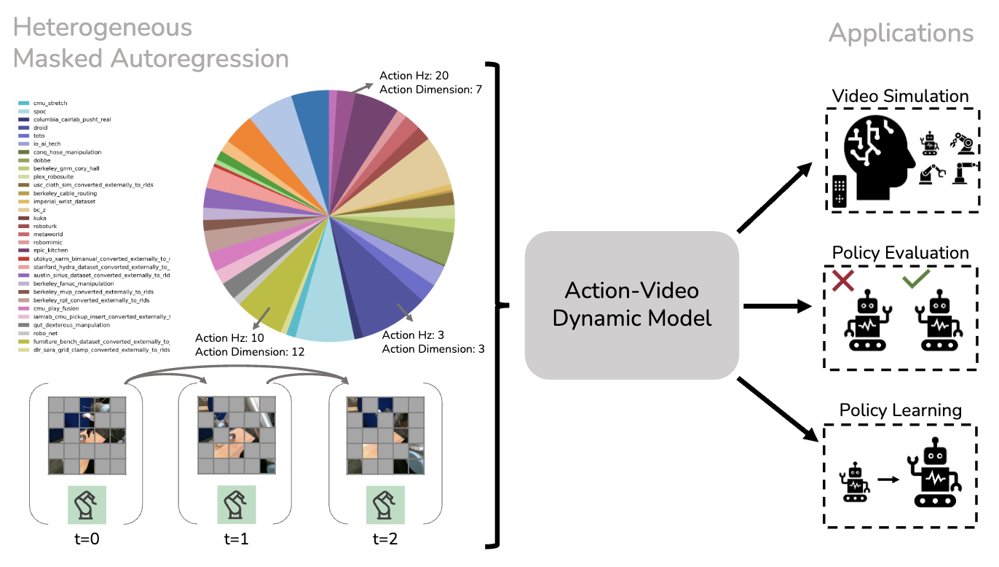

# Learning Robotic Video Dynamics with Heterogeneous Masked Autoregression

[](https://huggingface.co/liruiw/hma-base)
[](https://pytorch.org/get-started/locally/)
[](https://www.python.org)

[Arxiv](https://arxiv.org/pdf/2502.04296) [Website](https://liruiw.github.io/hma) [Demo](https://liruiw.github.io/hma/hma_demo)
<hr style="border: 2px solid gray;"></hr>




## Getting Started
We require `Python 3.10` or later. This code was tested with `Python 3.10.12`.

```
# Install dependencies and download data
./build.sh

# Source the Python environment
source venv/bin/activate
```

### Demo
0. Run the interactive demo: ``python -m sim.app``
1. Select a prompt initial image from the gallery
2. Interact with arrow keys

### Dataset Encoding/Tokenization
<details>
<summary><span style="font-weight: bold;">Detailed Commands</span></summary>
The one-line version of encoding one dataset is as the following example:
```shell
python -m datasets.encode_openx_dataset --episode_cnt 1000000 --dataset_name kaist_nonprehensile_converted_externally_to_rlds --data_split train --root_dir data
```

The dataset can be partitioned into multiple shards, and then one GPU can process each shard.
Shards are useful not only for parallelization but also for saving progress in case a process is interrupted.

Example encoding `droid` with 2 GPUs:
```shell
# Process 1
set -e
for ((i = 0; i < 64; i += 2)); do
    CUDA_VISIBLE_DEVICES=0 python -m datasets.encode_openx_dataset --dataset_name droid --data_split train --num_shards 64 --curr_shard_rank $i --root_dir sharded_data
done

# Process 2
set -e
for ((i = 1; i < 64; i += 2)); do
    CUDA_VISIBLE_DEVICES=1 python -m datasets.encode_openx_dataset --dataset_name droid --data_split train --num_shards 64 --curr_shard_rank $i --root_dir sharded_data
done
```

Then, merge the shards into one dataset.
Merging does not require all shards to be generated, missing shards will be skipped.

Example merge:
```shell
# Modify SHARD_DATA_FORMAT in dataset/merge_shards.py, not CLI arg b/c it's a format str
python datasets/merge_shards.py --out_data_dir merged_data/droid --num_shards 64
```

Non-OpenX datasets require using `datasets.encode_openx_dataset` instead of `datasets.encode_openx_dataset`, and currently the only such supported dataset is `egoexo4d`.
For every external dataset, the code for that dataset must be modified to allow iterating over only a subset (i.e. shard) of the dataset.

Example non-OpenX dataset:
```
python -m datasets.encode_extern_dataset --dataset_name egoexo4d --data_split train --num_shards 100 --curr_shard_rank 0 --root_dir sharded_data
```

To train and evaluate the soft tokens, we need to follow the same script but save dataset using non-VQ encoders. Similarly, to evaluate against the raw images, we need to use the script and save dataset without encoders ``--encoder_type temporalvae --encoder_name_or_path 'stabilityai/stable-video-diffusion-img2vid'``.
</details>

## Pre-Training Scripts (Single Dataset)
```
# Single Dataset Training, Generation, and Evaluation
python -m hma.train_multi --output_dir data/model

python hma/generate.py  --checkpoint_dir  data/model/step_100/  --val_data_dir data/kaist_nonprehensile_converted_externally_to_rlds_magvit_max1000000_val

python hma/visualize.py   --token_dir data/genie_generated

python hma/evaluate.py  --checkpoint_dir  data/model/step_100/  --val_data_dir data/kaist_nonprehensile_converted_externally_to_rlds_magvit_max1000000_val --use_tokeniz
ed_images
```

## Pre-Training Scripts (Multiple Datasets)
```

# Debug Run
bash experiments/scripts/run_debug.sh

# VQ tokens Model
bash experiments/scripts/discrete_model/run_40datasets_waction.sh

# Soft tokens Model
bash experiments/scripts/continuous_model/run_30datasets_mar_waction.sh

```

## Post-Training Scripts
1. Finetuning on language table dataset ``bash experiments/scripts/posttraining_scripts/run_langtable_finetuning.sh``

## Checkpoints
You can find pretrained HMA checkpoints here. At the moment we provide the following model versions:

| Model                                                                  |   Size         |
|--------------------------------------------------------------------------------|----------------|
| [HMA-MagVit](https://huggingface.co/liruiw/hma-base-disc)                 |  362M Params  |
| [HMA-MAR](https://huggingface.co/liruiw/hma-base-cont)                 |  1B Params  |


### Evaluation
Example on discrete model evaluation:
```shell
accelerate launch hma/evaluate.py \
        --checkpoint_dir "data/${RUN_NAME}/final_checkpt" \
        --val_data_dir "data/${dataset}_magvit_traj1000000_val" \
        --wandb_run_name "${RUN_NAME}"'

bash experiments/scripts/eval_action_scripts/run_evaluation_discrete.sh $MODEL $DATASET
```

Example on continuous model evaluation:
```shell
accelerate launch hma/evaluate_feature.py \
        --checkpoint_dir "data/${RUN_NAME}/final_checkpt" \
        --val_data_dir "data/${dataset}_magvit_traj1000000_val" \
        --wandb_run_name "${RUN_NAME}"

bash experiments/scripts/eval_action_scripts/run_evaluation_continuous.sh $MODEL $DATASET
```

## Note
1. Training, evaluation, and visualization are stored in different wandb projects.
2. Code quality: tired grad student.

## File Structures
```angular2html
├── ...
├── HMA
|   |── data 			# cached token datasets and model checkpoints
|   |── hma 			# main modeling code
|   |   |── model       # model related scripts
|   |   |── evaluate.py   # evaluate a trained model
|   |   |── generate.py    # generate tokens from trained model
|   |   |── train_multi.py # train on multiple datasets jointly
|   |   |── visualize.py # visualize generated tokens
|   |── sim 			# simulation related codebase
|   |── experiments
|   |   |── datasplit # dataset split
|   |   |── scripts # ablation and training scripts.
|   |── external 		# common utility
└── ...
```


### 🕹️ Citation
If you find HMA useful in your research, please consider citing:
```
@inproceedings{wang2025hma,
author    = {Lirui Wang, Kevin Zhao, Chaoqi Liu, Xinlei Chen},
title     = {Learning Robotic Video Dynamics with Heterogeneous Masked Autoregression},
booktitle = {Arxiv},
year      = {2025}
}
```

## Acknowledgement
0. [1xGPT](https://github.com/1x-technologies/1xgpt)
1. [MAR](https://github.com/LTH14/mar/)
2. [HPT](https://github.com/liruiw/hpt)


## Contact

If you have any questions, feel free to contact me through email (liruiw@mit.edu). Enjoy!
